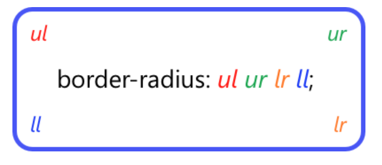
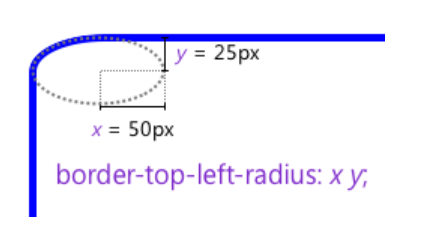
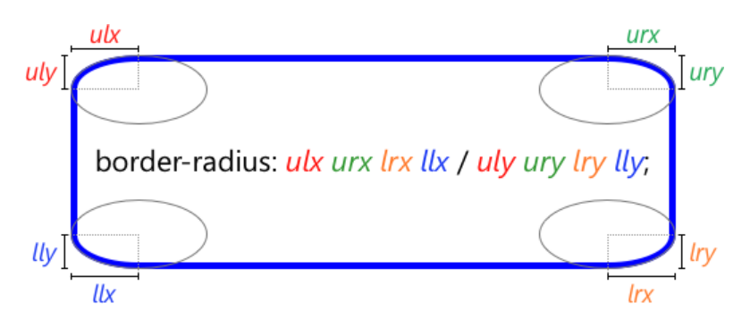

# 1장 CSS 기본 문법
- CSS는 HTML 요소의 style을 정의하는데 사용된다
## selector 선택자
- 셀렉터는 스타일을 적용하고자 하는 HTML요소를 선택하기 위해 CSS에서 제공하는 수단이다
- 셀렉터와 선언블록이 있는것을 룰셋(Rule set)이라하며 룰셋의 집합을 스타일시트라고한다
## Property 속성
- 프로퍼티는 표준 스펙으로 이미 지정되어 있는 것을 사용하며 사용자가 임의로 정의할수 없다
- 연속으로 지정할때는 세미콜론(;)으로 구분한다
## Vlaue/속성값
- 프로퍼티의 값은 해당 프로퍼티에 사용할 수 있는 값을 특정단위로 지정해야한다.
## HTML/CSS 연동
- Link Style : HTML에서 외부에 있는 CSS파일을 로드하는 방식
- Embedding style : HTML 내부에 CSS를 포함시키는 방식 하지만 둘의 역할이 다르므로 다른 파일로 구분하는게 좋다
- Inline style : HTML요소의 style 프로퍼티에 CSS를 기술하는 방식
## Reset CSS
- HTML요소의 CSS를 초기화 하는 용도로 사용한다 제각각인 디폴트 스타일을 하나로 통일해주는 역할이다

# 2장 셀렉터
- 복수개의 셀렉터는 쉼표(,)로 구분함
## 전체 셀렉터
- '*' : HTML의 모든 요소를 선택한다
## 태그 셀렉터 
- 태그명 : 지정된 태그명을 가지는 요소를 선택
## ID 셀렉터 
- #id속성값 : id속성값을 지정하여 일치하는 요소를 선택한다 중복될 수 없다
## 클래스 셀렉터 
- .class속성값 : class속성값을 지정하여 일치하는 요소를 선택한다 중복될 수 있다 
HTML요소에 class속성값은 공백을 구분하여 여러개 지정할수 있다. HTML요소에 미리 정의하여 필요한 스타일을 지정할수있다 
이것은 재사용 측면에서 유용하다

## 어트리뷰트 셀렉터 
- 셀렉터[어트리뷰트] : 지정된 어트리뷰트를 갖는 모든 요소을 선택한다
- 셀렉터[어트리뷰트="값"] : 지정된 어트리뷰트를 가지면서 지정된 값과 
  어트리뷰트 값이 일치하는 모든 요소 선택
- 셀렉터[어트리뷰트~="값"] : 지정된 어트르뷰트의 값이 지정된 값을 (공백으로 분리된)
  단어를 포함하는 요소선택
- 셀렉터[어트리뷰트|="값"] : 지정된 어트리뷰트의 값과 일치하거나 
 지정 어트리뷰트 값 뒤 연이은 하이픈("값-") 으로 시작하능 요소를 선택한
- 셀렉터[어트리뷰트^="값"] : 지정된 어트리뷰트 값으로 시작하는 요소를 선택한다
- 셀렉터[어트리뷰트$="값"] : 지정된 어트리뷰트 값으로 끝나는 요소를 선택한다
- 셀렉터[어트리뷰트*="값"] : 지정된 어트리뷰트 값을 포함하는 요소를 선택한다

## 복합 셀렉터
### 후손 셀렉터 
- 셀렉터A 셀렉터B (뛰어쓰기) : 자기보다 nlevel 하위에 속하는 요소는 후손 요소로 후손요소를 선택한다
### 자식 셀렉터 
- 셀렉터A > 셀렉터B : 자기보다 1level 하위에 속하는 요소는 자식요소로 자식요소를 선택한다
### 인접 형제 셀렉터 
- 셀렉터A + 셀렉터B : 셀렉터A의 형제 요소 중 셀렉터A 바로 뒤에 위치하는 셀렉터 B요소를 선택한다
  A와 B 사이에 다른 요소가 존재하면 선택이 안된다
### 일반 형제 셀렉터 
- 셀렉터A ~ 셀렉터B : 셀렉터A의 형제 요소 중 셀렉터A 뒤에 위치하는 셀렉터B 요소를 모두 선택한다

## 가상 클래스 셀렉터 
- 가상 클래스는 요소의 특정 상태에 따라 스타일을 정의할 때 사용된다. 
  콜론(:)을 사용하며 CSS표준에 의해 미리 정의된 이름이 있기 때문에 임의의 이름을 사용할 수 없다.
### 링크 셀렉터, 동적 셀렉터
- :link : 셀렉터가 방문하지 않은 링크일 때
- :visited : 셀렉터가 방문한 링크일 때
- :hover : 셀렉터에 마우스가 올라와 있을 때
- :active : 셀렉터가 클릭된 상태일 때
- :focus : 셀렉터가 포커스가 들어와 있을 때
### UI 요소 상태 셀렉터
- :checked : 셀렉터가 체크 상태일 때
- :enabled : 셀렉터가 사용 가능한 상태일 때
- :disabled : 셀렉터가 사용 불가능한 상태일 때
### 구조 가상 클래스 셀렉터
- :first-child : 셀렉터에 해당하는 모든 요소 중 첫번째 자식인 요소를 선택한다
- :last-child : 셀렉터에 해당하는 모든 요소 중 마지막 자식인 요소를 선택한다
- :nth-child(n) : 셀렉터에 해당하는 모든 요소 중 앞에서 n번째 자식인 요소를 선택한다
- :nth-last-child(n) : 셀렉터에 해당하는 모든 요소 중 뒤에서 n번째 자식인 요소를 선택한다
- :first-of-type : 셀렉터에 해당하는 요소의 부모 요소의 자식 요소 중 첫 번째 등장하는 요소를 선택한다
- :last-of-type : 셀렉터에 해당하는 요소의 부모 요소의 자식 요소 중 마지막에 등장하는 요소를 선택한다
- :nth-of-type(n) : 셀렉터에 해당하는 요소의 부모 요소의 자식 요소 중 앞에서 n번째 등장하는 요소를 선택한다
- :nth-last-of-type(n) : 셀렉터에 해당하는 요소의 부모 요소의 자식 요소 중 뒤에서 n번째 등장하는 요소를 선택한다
### 부정 셀렉터
- :not(셀렉터) : 셀렉터에 해당하지 않는 모든 요소를 선택한다
### 정합성 체크 셀렉터
- :valid(셀렉터) : 정합성 검증이 성공한 input 요소 또는 form 요소를 선택한다 (pattern에 일치할떄)
- :invalid(셀렉터) : 정합성 검증이 실패한 input 요소 또는 form 요소를 선택한다 (pattern에 일치하지 않을때)

## 가상 요소 셀렉터 
  가상 요소는 요소의 특정 부분에 스타일을 적용하기 위하여 사용된다. 콜론 두개(::)를 사용한다
- ::first-letter : 콘텐츠의 첫글자를 선택한다
- ::first-line : 콘텐츠의 첫줄을 선택한다. 블록 요소에만 적용할 수 있다
- ::after : 콘텐츠의 뒤에 위치하는 공간을 선택한다. 일반적으로 content 프로퍼티와 함께 사용된다
- ::before : 콘텐츠의 앞에 위치하는 공간을 선택한다. 일반적으로 content 프로퍼티와 함께 사용된다
- ::selection : 드래그한 콘텐츠를 선택한다. IOS Safari등 일부 브라우저에서 동작하지 않는다.

# 3장 CSS 프로퍼티 값의 단위
## 키워드
각 프로퍼티에 따라 사용할수 있는 키워드가 존재한다 
display 프로퍼티의 값으로 사용할 수 있는 키워드는 block, inline, inline-block, none이 있다 
## 크기단위
cm,mm,inch등의 단위도 존재한다. 0인 경우 생갹 가능하다
### px
px은 픽셀(화소)단위이다. 1px은 화소 1개의 크이를 의미한다 
픽셀은 디바이스 해상도에 따라 상대적인 크기를 갖는다 
디바이스 별로 픽셀(화소)의 크기는 제각각이기 때문에 픽셀의 기준으로 하는 단위는 명확하지 않다 
따라서 대부분의 브라우저는 1px을 1/96인치의 절대단위로 인식한다 
### %
%는 백분률 단위의 상대 단위이다. 요소에 지정된 사이즈(상속된 사이즈나 디폴트 사이즈)에 상대적인 사이즈를 설정한다
### em
배수 단위로 상대 단위이다. 1em은 요소에 지정된 사이즈와 같고 2em은 요소에 지정된 사이즈의 2배이다 
폰트 사이즈 설정이나 콘텐츠를 포함하는 컨테이너의 크기 설정에 사용하면 상대적인 설정이 가능하여 편리하다 
중첩된 자식 요소에 em을 지정하면 모든 자식 요소의 사이즈에 영향을 미친다 

### rem
rem은 최상위 요소의 사이즈를 기준으로 삼는다. rem의 r은 root를 의미한다 
사용자가 브라우저의 기본 폰트 크기를 변경하더라도 이에 따라 웹 사이트의 레이아웃을 적절히 저정할 수 있다는 장점이 있다 
폰트 사이즈 뿐만 아니라 콘텐츠 크기에 따라 가변적으로 대응하여야 하는 wrapper요소 등에 적합하다 
Reset CSS를 사용하여 사전에 HTML요소의 font-size 지정이 필요하다 font-size 미정시 16px가 적용된다 
### Viewport 단위
반응형 웹디자인은 화면의 크기에 동적으로 대응하기 위해 %단위를 자주 사용한다 
하지만 %단위는 em과 같이 상속에 의해 부모요소에 상대적 영향을 받는다 
viewport 단위는 viewport를 기준으로 한 상대적 사이즈를 의미한다 
- vw : viewport 너비의 1/100
- vh : viewport 높이의 1/100
- vmin : viewport 너비 또는 높이 중 작은 쪽의 1/100
- vmax : viewport 너비 또는 높이 중 큰 쪽의 1/100
#### 반응형 웹
  하나의 웹사이트로 데스크탑 PC, 스마트폰, 태블릿 PC 등 접속하는 디스플레이의 종류에 
  따라 화면의 크기가 자동으로 변하도록 만드는 웹페이지를 말합니다
#### viweport
  웹페이지가 사용자에게 보여지는 영역을 말합니다

## 색상 표현 단위
색상을 표현할수 있는 키워드 리스트 <https://www.w3.org/TR/css-color-3/> 참조 
더욱 다양한 색상을 표현하기 위해 생상 표현 단위를 사용할수 있는데 이때 참조 <https://htmlcolorcodes.com/>
- HEX 코드 단위 : #000000
- RGB(red,green,blue) : rgb(255,255,0)
- RGBA (Red, Green, Blue, Alpha/투명도) :	rgba(255, 255, 0, 1)
- HSL (Hue/색상, Saturation/채도, Lightness/명도) :	hsl(0, 100%, 25%)
- HSLA (Hue, Saturation, Lightness, Alpha) : hsla(60, 100%, 50%, 1)

# 4장 박스모델
HTML에서 Box는 콘텐츠(content), 패딩(padding), 테두리(border), 마진(margin)으로 구성되어있다. 
브라우저는 박스 모델의 크기와 프로퍼티, 위치를 근거하여 렌더링을 실행한다 
웹디자인은 콘텐츠를 담을 박스 모델을 정의하고 CSS 프로퍼티를 통해 스타일과 위치 및 정렬을 지정하는 것이라 할수 있다 

- Content : 요소의 텍스트나 이미지 등의 실제 내용이 위치하는 영역이다. width, height 프로퍼티를 갖는다.
- Padding : 테두리 안쪽에 위치한 요소의 내부 여백 영역으로 padding 프로퍼티 값은 패딩 영역의 두께를 의미한다
  기본적색은 투명이다. 요소에 적용된 배경의 컬러, 이미지는 패딩 영역까지 적용된다
- Border : 테두리 영역으로 border 프로퍼티 값은 테두리의 두께를 의미한다
- Margin : 테두리(Border)바깥에 위치하는 요소의 외부 여백 영역으로 margin 프로퍼티 값은
  마진 영역의 두께를 의미하고 기본족으로 투명하며 배경색을 지정할 수 없다

## width/height 프로퍼티
- 요소의 너비와 높이를 지정하기 위해 사용된다 이때 지정되는 요소의 너비와 높이는 콘텐츠 영역을 대상으로 한다
- width/height로 지정한 콘첸츠영역 보다 실제 콘텐츠가 크면 콘텐츠 영역을 넘치게 된다
  이때 `overflow:hidden;`을 지정하면 넘치는 콘텐츠를 감출 수 있다
- 박스의 전체 크기의 너비는 콘텐츠의 너비와 padding, border, margin들의 너비를 모두 합친값이고
  높이는 모든 높이를 합친 값이다
- 이 프로퍼티의 초기값은 auto로 브라우저의 상황에 따라 계산된다
  block요소의 경우 width는 부모요소의 100%, height는 콘텐츠의 높이(+약건의 여분)가 지정된다
- 명시적으로 지정하기 위해 px,%등의 크기단위를 사용한다

## margin/padding 프로퍼티
- margin/ padding프로퍼티는 content의 4개 방향에 대하여 지정이 가능하다

### margin/padding 값의 개수별 지정방식 
- 4개의 값을 지정하였을때 : matgin:??px!!px@@px##px => ?? = top / !! = right / @@ = bottom / ## = left 
- 3개의 값을 지정하였을때 : matgin:??px!!px@@px => ?? = top / !! = right,left / @@ = bottom
- 2개의 값을 지정하였을때 : matgin:??px!!px => ?? = top,bottom / !! = right,left
- 1개의 값을 지정하였을때 : matgin:??px => ?? = top,right,left,bottom 

- margin 프로퍼티에 auto 키워드를 설정하면 해당 요소는 브라우저 중앙에 위치 시킬 수 있다
- max-width 프로퍼티를 사용하면 요소의 너비가 브라우저 너비보다 크면 스크롤바가 만들어진다

## border 프로퍼티 
<https://developer.mozilla.org/ko/docs/Web/CSS/border-width>참조
### border-style
- solid : 실선 / dotted : 점선 / none : 선없는 등등
- 4개의 방향에 대하여 지정할수 있다
### border-width
- 프로퍼티의 테두리의 두께를 지정한다. 4개의 방향을 지정할수 있다
- 크기단위가 사용 가능하다 (%,px,em,rem)
- thin : 얇은 테두리 / medium : 중간 테두리 / thick : 굵은 테두리
- border-width는 border-style과 같이 사용하지 않으면 안된다(border-style이 선언되어야한다)
### border-color
- 테두리의 색상을 지정한다 4방향 지정 가능하다
- border-color는 border-style과 같이 사용하지 않으면 안된다(border-style이 선언되어야한다)
### border-radius
<https://developer.mozilla.org/en-US/docs/Web/CSS/border-radius>참조
- 테두리의 모서리를 둥글게 표현하도록 지정한다. 4방향 모두 가능하다
- 프로퍼티 값은 크기단위를 사용한다
- 하나 혹은 두개의 반지름을 설정하여 각각의 모서리 굴곡을 설정할 수 있기 때문에 원 혹은 타원의 모양을 정의가 가능하다
- 각각의 모서리를 개별적으로 설정가능 

- 두개의 반지름을 지정하여 타원형 둥근 모서리 설정가능 

- 각각의 모서리에 타원형 둥근 모서리 축약 설정 가능 

### border
boder 프로퍼티는 border-width, border-style, border-color를 한번에 할수있다 (short-hand)
## border-sizing
- content-box : width,height 프로퍼티 값은 content 영역을 의미한다 (기본값)
- border-box : content영역에 padding, border까지 포함된 값을 의미한다

# 5장 display, visibility, opacity 프로퍼티
## display 프로퍼티
display 프로퍼티는 layout 정의에 자주 사용되는 중요한 프로퍼티이다
- block : block 특성을 가지는 요소로 지정
- inline : inline 특성을 가지는 요소로 지정
- inline-block : inline-block 특성을 가지는 요소로 지정
- none : 해당요소를 화면에 표시하지 않는다
### block 레벨 요소
#### block 특성을 가지는 요소의 특징
- 항상 새로운 라인에서 시작한다
- 화면 크기 전체의 가로폭을 차지한다
- width, height, margin, padding 프로퍼티 지정이 가능하다
- block 레벨 요소 내에 inline 레벨 요소를 포함할 수 있다
- block 레벨 요소 예 : div, h1~h6, p, 리트스(ol,ul,li), hr, table, form 등
### inline 레벨 요소
#### inline 특성을 가지는 요소의 특징
- 새로운 라인에서 시작하지 않으면 문장의 중간에 들어갈 수 있다. 즉 줄을 바꾸지 않고 다른 요소와 함께 한 행에 위치한다
- content의 너비만큼 가로폭을 차지한다
- width, height, margin-top, margin-bottom 프로퍼티 지정할 수 없다. 상,하 여백은 line-height로 지정한다
- inline 레벨 요소 뒤에 공백(엔터, 스페이스 등)이 있는 경우 정의하지 않은 space가 자동 지정된다
- inline 레벨 요소 내에 block 레벨 요소를 포함할 수 없다. inline 레벨 요소는 일반적으로 block 레벨 요소에 포함되어 사용된다
- inline 레벨 요소 예 : span, a, strong, img, br, input, select, textarea, button 등
### inline-block 레벨 요소
#### inline-block 특성을 가지는 요소의 특징
- 기본적인 inline 레벨 요소와 흡사하게 줄을 바꾸지 않고 다른 요소와 함께 한 행에 위치시킬 수 있다
- block 레벨 요소처럼 width, height, margin, padding 프로퍼티를 모두 정의할 수 있다
  상,하 여백을 margin과 line-hegint 두ㅏ지 프로퍼티 모두를 통해 제어할 수 있다
- content의 너비 만큼 가로폭을 차지한다.
- inline-block 레벨 요소 뒤에 공백이 있을 경우 정의하지 않은 space가 자동 지정된다
## visibility 프로퍼티
visibility 프로퍼티는 요소를 보이게 할 것인지를 정의한다. 요소의 렌더링 여부를 결정한다
- visible : 해당 요소를 보이게 한다
- hidden : 해당 요소를 보이지 않게 한다 `display:none;`은 해당 요소의 공간까지 사라지게 하지만
  `visibility : hidden;`은 해당 요소의 공간은 사라지지 않고 남아 있게 된다
- collapse : table 요소에 사용하며 행이나 열을 보이지 않게 한다
- none : table 요소의 row나 column을 보이지 않게 한다
## opacity 프로퍼티
opacity 프로퍼티는 요소의 투명도를 정의한다. 0.0~1.0의 값을 입력하며 0.0은 투명, 1.0은 불투명을 의미한다

# 6장 백그라운드
백그라운드는 해당 요소의 배경으로 이미지 또는 색상을 정의한다
## background-image 프로퍼티
요소에 배경 이미지를 지정한다
## background-repeat 프로퍼티
배경이미지의 반복을 지정한다
- repeat : 프로퍼티의 기본값
- repeat-x : x축으로만 배경 이미지를 반복할 경우
- repeat-y : y축으로만 배경 이미지를 반복할 경우
- no-repeat : 반복 출력을 멈추고 싶은 경우
**background-image에 복수개의 이미지를 설정할 경우 먼저 설정된 이미가 전면에 출력된다 이때 background-repeat도 같은 순으로 순서에 맞게 적용된다**
## background-size 프로퍼티
배경 이미지의 사이즈를 지정한다 
첫번째 값은 width, 두번째 값은 height를 의미한다 
하나의 값만 지정한경우 지정한 값은 width를 의미하게 되며 height는 auto로 지정된다
- px값 지정 : 배경이미지 크기가 지정된 px값 그대로 설정된다
- %값 지정 : 배경이미지 크기가 지정된 %값에 비례하여 설정된다.
  화면을 줄이거나 늘리면 배경이미지의 크기도 따라서 변경되어 찌그러지는 현상이 나타난다
- cover 지정 : 배경이미지의 크기 비율을 유지한 상태에서 부모 요소의 width,height 중 큰값에 배경이미지를 맞춘다.
  따라서 이미지의 일부가 보이지 않을 수 있다
- contain 지정 : 배경이미지의 크기 비율을 유지한 상태에서 부모 요소의 영역에 배경이미지가 보이지 않는 부분없이
  전체가 들어 갈 수 있도록 이미지 스케일을 조정한다
## background-attachment 프로퍼티
일반적으로 화면을 스크롤하면 배경 이미지도 함께 스크롤 되는데 화면이 스크롤 되더라도
 배경 이미지는 스크롤되지 않고 고정 되어 있게 하려면 `background-attachment : fixed;` 를 지정한다
## background-position 프로퍼티
일반적으로 background-image는 최상단부터 이미지를 출력한다. 이때 background-position 프로퍼티를 사용하면 이미지의 좌표(xpos,ypos)를 지정 할 수 있다. 
기본값은 `background-position : 0% 0%;`로 배경이미지는 우측 상단에 위치하게 된다 
top, bottom, center, left, right 도 같이 사용할수 있다
## background-color 프로퍼티
요소의 배경색을 지정한다 색상값 또는 투명도 키워드를 지정할 수 있다
## background Shorthand
background: color || image || repeat || attachment || position 을 한번에 지정할수 있다 
`background: #FFEE99 url("http://poiemaweb.com/img/bg/dot.png") no-repeat center;`

# 7장 폰트와 텍스트
## font-size 프로퍼티
텍스트의 크기를 정의한다
## font-family 프로퍼티
폰트를 지정한다 컴퓨터에 해당 폰트가 설치되어 있지 않으면 적용되지 않는다 
폰트는 여러 개를 동시에 지정이 가능하다. 첫번째 지정한 폰트가 클라이언트 컴퓨터에 설치되어 있지 않은 경우, 다음에 지정된 폰트를 적용한다. 따라서 마지막에 지정하는 폰트는 대부분의 OS에 기본적으로 설치되어 있는 `generic-family` 폰트(Serif, Sans-serif, Mono space)를 지정하는 것이 일반적이다.
## font-style / font-weight 프로퍼티
- font-style 프로퍼티는 이탤릭체의 지정(normal, italic, oblique) 
- font-weight 프로퍼티는 폰트 굵기 지정(100~900/ normal/ bold/ lighter/ bolder)
## line-height 프로퍼티
텍스트의 높이를 지정한다. 텍스트 수직 정렬에도 응용되어 사용된다 
수직 중앙정렬를 할때 부모요소와 자식요소의 height값을 일치시킨다 (부모가 박스면 height 자식이 텍스트이면 line-height)
## font shorthand
font : font-style(optional) font-variant(optional) font-weight(optional) font-size(mandatory) line-height(optional)font-family(mandatory) 
### font-variant small-caps; 소문자를 대문자로 만든다. 단 크기는 일반 대문자에 비해 더 작다.
## letter-spacing 프로퍼티
글자사이의 간격을 지정한다
## text-align 프로퍼티
텍스트의 수평 정렬을 정의한다 (center, right, left, justify) 
a태그는 inline요소 이므로 center가 적용이 안된다 이때 display:block을 지정하면 중앙정렬이 가능하다
## text-decoration 프로퍼티
링크의 underline을 제거할수도(none) 있고 텍스트에 underline, overline, line-through를 추가할 수도 있다
## white-space 프로퍼티
space는 공백,들여쓰기,줄바꿈을 의미한다 HTML에서 기본적으로 연속적인 공백과 들여쓰기는 한번만 실행된고 줄바꿈은 무시된다 
또한 텍스트는 부모의 가로 영역을 벗어나지 않고 자동 줄바꿈 된다. white-space는 이러한 동작을 제어할수있다
## text-overfloe 프로퍼티
## word-wrap 프로퍼티
## word-break 프로퍼티

# 8장 요소의 위치 정의
## position 프로퍼티
요소의 위치를 정의한다, top, bottom, left, right 프로퍼티와 함께 사용하여 위치를 지정한다
### static(기본위치)
- static은 position 프로퍼티의 기본값으로 position 프로퍼티를 지정하지 않았을 때와 같다
- 부모 요소 내에 자식 요소로서 존재할 떄는 부모 요소의 위치를 기준으로 배치한다
- 이미 설정된 position을 무력화 하기 위해 사용될 수 있다

### relative(상대위치)
- static를 기준으로 좌표(top, bottom, left, right) 프로퍼티를 사용하여 위치를 이동시킨다
- static와 relative의 차이점은 좌표 프로퍼티의 동작 여부 뿐이며 그외는 동일하게 동작한다

### absolute(절대위치)
- 부모 요소 또는 가장 가까이 있는 조상 요소(static 제외)를 기준으로 좌표 프로퍼티 만큼 이동한다
  즉 상대위치, 절대위치, 고정위치 프로퍼티가 선언되어 있는 부모 또는 조상 요소를 기준으로 위치가 결정된다
- 만일 부모 또는 조상 요소가 static인경우 document body를 기준으로 하여 좌표 프로퍼티를 위치하게 된다
- absolute 선언시, block 레벨 요소의 width는 inline 요소와 같이 content에 맞게 변화되므로 적절한 width를 지정하여야 한다

#### relative는 무조건 부모를 기준으로 위치한다
#### absolute는 부모 요소의 영역을 벗어나 자유롭게 어디든 위치할 수 있다

### fixed(고정위치)
- 부모 요소와 관계 없이 브라우저의 viewport를 기준으로 좌표프로퍼티을 사용하여 위치를 이동시킨다
- 스크롤이 되더라도 화면에서 사라지지 않고 항상 같은 곳에 위치한다
- fixed 선언시, block 요소의 width는 inline 요소와 같이 content에 맞게 변화되므로 적절한 width를 지정하여야 한다

## z-index 프로퍼티
z-index 프로퍼티에 큰 숫자값을 지정할수록 화면 전면에 출력된다. position 프로퍼티가 static 이외인 요소에만 적용된다

## overflow 프로퍼티
자식 요소가 부모 요소의 영역을 벗어났을 때 처리 방법을 정의한다
- visible : 영역을 벗어난 부분을 표시한다(기본값)
- hidden : 영역을 벗어난 부분을 잘라내어 보이지 않게 한다
- scroll : 영역을 벗어난 부분이 없어도 스크롤 표시한다(현재 대부분 브라우저는 auto과 동일하게 작동한다)
- auto : 영역을 벗어난 부분이 있을때만 스크롤 표시한다
#### 특정 방향으로만 스크롤을 표시하소자 할때 overflow-x또는 overflow-y를 사용한다

####